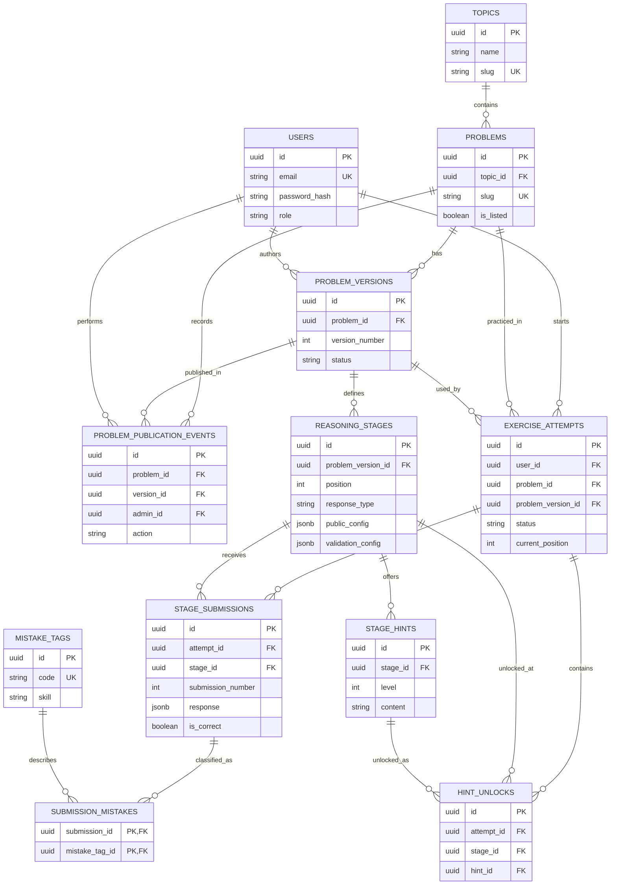

*placeholder for erd/main tables/relationships*

gonna use mermaid

need update in week1 for postgreSQL schema

---

# ERD v0.1

```mermaid

erDiagram
    TOPICS {
        uuid id PK
        string name
        string slug UK
    }

    USERS {
        uuid id PK
        string email UK
        string password_hash
        string role
    }

    PROBLEMS {
        uuid id PK
        uuid topic_id FK
        string slug UK
        boolean is_listed
    }

    PROBLEM_VERSIONS {
        uuid id PK
        uuid problem_id FK
        int version_number
        string status
    }

    PROBLEM_PUBLICATION_EVENTS {
        uuid id PK
        uuid problem_id FK
        uuid version_id FK
        uuid admin_id FK
        string action
    }

    REASONING_STAGES {
        uuid id PK
        uuid problem_version_id FK
        int position
        string response_type
        jsonb public_config
        jsonb validation_config
    }

    EXERCISE_ATTEMPTS {
        uuid id PK
        uuid user_id FK
        uuid problem_id FK
        uuid problem_version_id FK
        string status
        int current_position
    }

    STAGE_SUBMISSIONS {
        uuid id PK
        uuid attempt_id FK
        uuid stage_id FK
        int submission_number
        jsonb response
        boolean is_correct
    }

    MISTAKE_TAGS {
        uuid id PK
        string code UK
        string skill
    }

    SUBMISSION_MISTAKES {
        uuid submission_id PK, FK
        uuid mistake_tag_id PK, FK
    }

    STAGE_HINTS {
        uuid id PK
        uuid stage_id FK
        int level
        string content
    }

    HINT_UNLOCKS {
        uuid id PK
        uuid attempt_id FK
        uuid stage_id FK
        uuid hint_id FK
    }

    TOPICS ||--o{ PROBLEMS : contains

    PROBLEMS ||--o{ PROBLEM_VERSIONS : has
    USERS ||--o{ PROBLEM_VERSIONS : authors

    PROBLEMS ||--o{ PROBLEM_PUBLICATION_EVENTS : records
    PROBLEM_VERSIONS ||--o{ PROBLEM_PUBLICATION_EVENTS : published_in
    USERS ||--o{ PROBLEM_PUBLICATION_EVENTS : performs

    PROBLEM_VERSIONS ||--o{ REASONING_STAGES : defines
    USERS ||--o{ EXERCISE_ATTEMPTS : starts
    PROBLEMS ||--o{ EXERCISE_ATTEMPTS : practiced_in
    PROBLEM_VERSIONS ||--o{ EXERCISE_ATTEMPTS : used_by

    EXERCISE_ATTEMPTS ||--o{ STAGE_SUBMISSIONS : contains
    REASONING_STAGES ||--o{ STAGE_SUBMISSIONS : receives

    STAGE_SUBMISSIONS ||--o{ SUBMISSION_MISTAKES : classified_as
    MISTAKE_TAGS ||--o{ SUBMISSION_MISTAKES : describes

    REASONING_STAGES ||--o{ STAGE_HINTS : offers
    EXERCISE_ATTEMPTS ||--o{ HINT_UNLOCKS : contains
    REASONING_STAGES ||--o{ HINT_UNLOCKS : unlocked_at
    STAGE_HINTS ||--o{ HINT_UNLOCKS : unlocked_as
```
